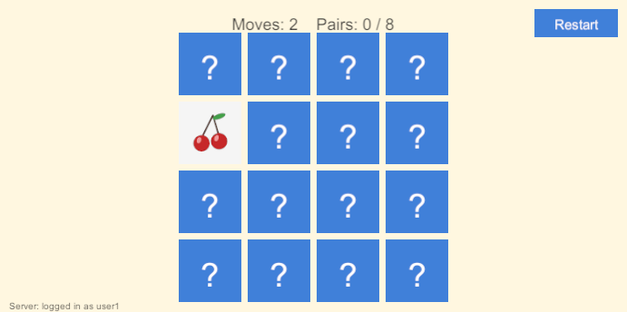

# unity_test

A memory (concentration) card game built with Unity, played with fruit pictures. When you clear a round, it sends your score to a companion API server and shows the ranking.



## Related repositories

| Repository | Description |
|---|---|
| [unity_test_server](https://github.com/ttsukahara967/unity_test_server) | The score API this game talks to (ASP.NET Core + MySQL, JWT authentication, Docker Compose) |

## Features
- 4×4 board with 8 fruit pairs, card flip animation, move counter, and a Restart button.
- The whole UI is built from code at runtime, so no scene setup is needed. Just press Play.
- On startup the game logs in to the score server. When you clear a round it submits your move count and shows the top 5 of the ranking.
- If the server is not running, the game still works and the bottom-left status shows `Server: offline`.

## Requirements
- Unity **6000.6.2f1** (Universal 3D / URP template). The Input System and uGUI packages are already listed in `Packages/manifest.json`.
- Optional: the score server from [unity_test_server](https://github.com/ttsukahara967/unity_test_server), running on `http://localhost:5080`.

## Run
1. Clone this repository and add the folder in Unity Hub (**Add > Add project from disk**). Use the editor version above.
2. Open the project. The first import takes a few minutes.
3. Press **Play**.

To send scores, start the server first (see its README):

```bash
docker compose up -d --build
```

## How to play
Click two cards to flip them. A matching pair stays face up; a mismatch flips back after a short delay. Match all 8 pairs in as few moves as you can.

## Score server connection
- The game connects to `http://localhost:5080` and logs in with the development account `user1` / `pass`. Both are constants at the top of [`Assets/Scripts/ScoreApiClient.cs`](Assets/Scripts/ScoreApiClient.cs).
- Unity rejects plain HTTP by default. [`Assets/Editor/AllowInsecureHttp.cs`](Assets/Editor/AllowInsecureHttp.cs) allows it in the Editor and in development builds only (**Player Settings > Other Settings > Allow downloads over HTTP**).

## Project layout
```
Assets/
  Scripts/MemoryGame.cs        Game logic and runtime-built UI
  Scripts/ScoreApiClient.cs    Login, score submission, and ranking requests
  Editor/AllowInsecureHttp.cs  Enables HTTP for development
  Resources/Fruits/            Card images (PNG, one image per pair)
```

## Card images
The PNGs in `Assets/Resources/Fruits` are simple illustrations. Replace them with your own images, or add more (up to 8 are used); each image becomes one pair.

## Notes
- The login credentials are development defaults and are stored in the code. There is no login screen yet.
- The game reports only the move count and the number of pairs. There is no timer yet.
